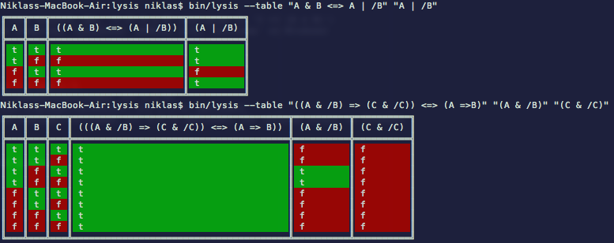

# Lysis

Python based solver for propositional calculus.

## Command-line interface

## Features

- operator precedence is taken into account (eg. `C => A & B` evaluates to `C => (A & B)`)
- colorized output if supported (requires `termcolor` module, plus `colorama` on Windows)
- unicode table-frame

## Requirements

- Python 2 (tested under Python 2.5 and 2.7)
- [scan](https://github.com/NiklasRosenstein/scan) (>= 4.6.0)
- [termcolor](https://pypi.python.org/pypi/termcolor) (>= 1.1.0; optional)
- [colorama](https://pypi.python.org/pypi/colorama) (>= 0.2.7; optional, for colored output on Windows)

## License

Lysis is licensed under the MIT License.
